<p align="center">
  
</p>

# Knowledge AI

**A trustworthy company intelligence layer that can ask, understand, act, and watch.**

Knowledge AI started as a document-grounded assistant and has grown into a private company intelligence platform. It combines evidence-backed Ask, structured analytics, Insights, Living Company Knowledge, safe Actions, Watch rules, Integrations, and controlled Automation while preserving provenance, tenant isolation, auditability, and explicit refusal when evidence is insufficient.

## Product promise

Knowledge AI should make four things easy:

1. **Bring your knowledge** — create a workspace and upload authoritative documents.
2. **Ask naturally** — ask direct, follow-up, comparison, numerical, and multilingual questions.
3. **Verify the answer** — see the supporting document, page, section, and evidence snippet.
4. **Trust the boundary** — unsupported questions should be refused clearly rather than answered from unverified model knowledge.

The advanced RAG, GraphRAG, corrective retrieval, memory, orchestration, and telemetry systems exist to support that promise. They are implementation details, not the primary user experience.

## Core workflow

```text
Create workspace
      ↓
Upload documents
      ↓
Index and structure knowledge
      ↓
Ask a question
      ↓
Retrieve + rerank evidence
      ↓
Check evidence sufficiency
      ↓
Generate an evidence-backed answer
      ↓
Verify claims + show citations
```

## Trust principles

- Uploaded and approved workspace documents are the authoritative source of truth.
- Retrieval must run for every factual document question.
- Model output must not silently replace missing evidence with general knowledge.
- Answers should expose verifiable citations.
- Unsupported or out-of-domain questions should abstain.
- Benchmarks must measure real retrieval and generation behavior; benchmark answers must not be hard-coded into the production reasoning path.
- Simulated provider metrics must be explicitly labeled as simulated.
- Production telemetry must distinguish measured values from estimates.

## Current architecture

The project currently includes:

- React 19 + Vite frontend
- Express + TypeScript backend
- PostgreSQL-authoritative multi-tenant application state
- S3-compatible durable source/object storage
- evidence-grounded document Ask with citations and abstention
- CSV/XLSX Dataset analytics and historical versions
- Insights and Living Company Knowledge
- safe natural-language Actions with transactional confirmation
- Watch rules and controlled Automation
- Google Drive and Microsoft OneDrive integration foundations
- durable PostgreSQL worker jobs with retries, leases, dead-letter state, and health/readiness
- encrypted SecretStore/KMS boundary for OAuth credentials
- role-aware human sessions plus separate API-key machine identity
- organization/member administration and privileged platform management
- production observability, recovery validation, and operator diagnostics
- reproducible non-root production image and immutable staging/release promotion gate
- load, abuse, race/idempotency, and adversarial regression gates
- evaluation, unseen-corpus, and live Gemini benchmark tooling

Gemini is currently the primary live LLM path. A deterministic grounded generator remains available as a grounded fallback when live generation is unavailable.

The complete Product Phase 0–8 roadmap and Production Hardening A–J roadmap have both passed their defined exit gates. The next committed work is real staging/pilot/launch execution rather than another speculative hardening phase.

## Run locally

```bash
npm install
cp .env.example .env
npm run dev
```

Set a Gemini API key in `.env` when you want live model generation:

```env
GEMINI_API_KEY=your_key_here
```

Quality checks:

```bash
npm run lint
npm run build
```

## Current priorities

The core product and A–J hardening roadmaps are complete.

Current execution priority is:

1. Real staging promotion through the existing release gate
2. Staging failure/recovery rehearsal
3. Real pilot onboarding
4. Measured pilot quality fixes
5. Explicit production launch readiness

Trust priorities remain non-negotiable throughout launch:

- retrieval correctness
- citation correctness
- unsupported-question refusal accuracy
- tenant isolation
- transactional/idempotent writes
- durable restart/recovery behavior
- honest telemetry and readiness
- safe role/approval boundaries

New model providers, integrations, infrastructure, and commercial features should be added only when measured product or operational evidence justifies them.

## Success metrics

The product should be evaluated on metrics such as:

- answer correctness
- retrieval recall / hit rate
- citation precision
- claim grounding rate
- unsupported-question refusal accuracy
- false-refusal rate
- hallucination rate
- conversational follow-up accuracy
- multilingual retrieval quality
- latency and provider failure rate

See `docs/CURRENT_PRODUCT_STATE_AND_ROADMAP.md` for the canonical current product state, committed launch roadmap, and clearly separated optional future ideas.

See `docs/PRODUCT_DIRECTION.md` and `docs/EFFECTIVENESS_AUDIT.md` for the product contract and effectiveness findings.

For the larger destination beyond the current document-assistant milestone, see `docs/LONG_TERM_PRODUCT_VISION.md`. It defines the long-term direction toward a living company intelligence layer that can **read, understand, act, and watch** while preserving evidence, permissions, history, and safe approvals.

For the implementation sequence and phase exit gates, see `docs/IMPLEMENTATION_ROADMAP.md`. It defines the ordered path from the current trustworthy knowledge foundation through structured data, discovery, living company knowledge, safe actions, proactive Watch, integrations, controlled automation, and the eventual platform layer.


## Project continuity

- [`docs/MASTER_EXECUTION_HANDOFF.md`](docs/MASTER_EXECUTION_HANDOFF.md) — canonical cross-chat execution status and exact next task.


## Platform and production roadmap

- [`docs/PLATFORM_API_V1.md`](docs/PLATFORM_API_V1.md) — stable Platform API v1 developer contract.
- [`docs/PHASE_8_FINAL_AUDIT.md`](docs/PHASE_8_FINAL_AUDIT.md) — final extensible-platform exit audit.
- [`docs/PRODUCTION_HARDENING_ROADMAP.md`](docs/PRODUCTION_HARDENING_ROADMAP.md) — completed historical A–J production-hardening roadmap.
- [`docs/CURRENT_PRODUCT_STATE_AND_ROADMAP.md`](docs/CURRENT_PRODUCT_STATE_AND_ROADMAP.md) — canonical current state, committed L1–L5 launch roadmap, and optional future ideas.
